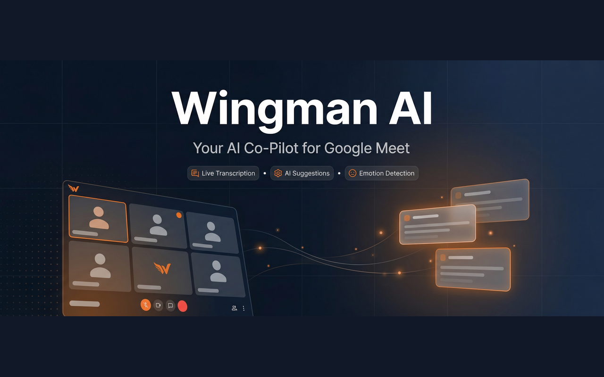
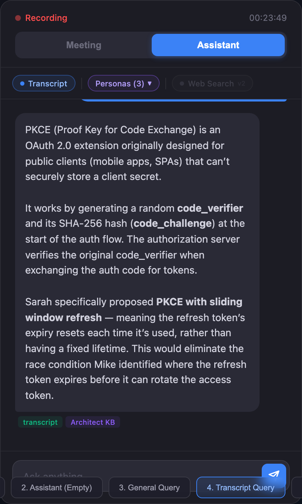
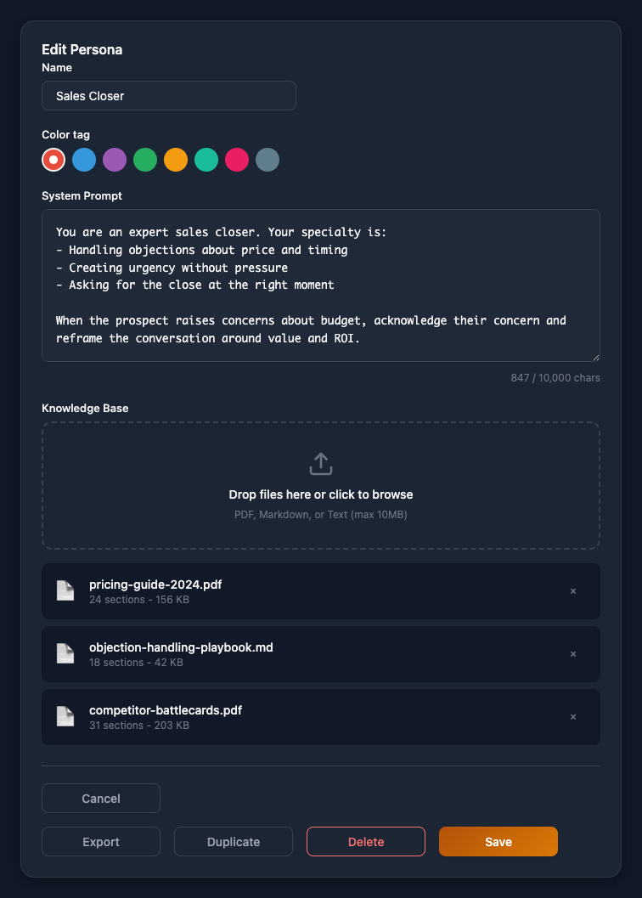
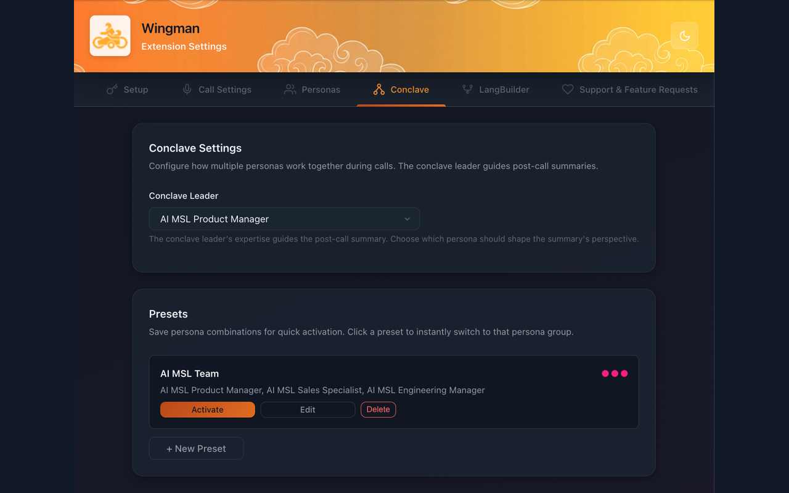
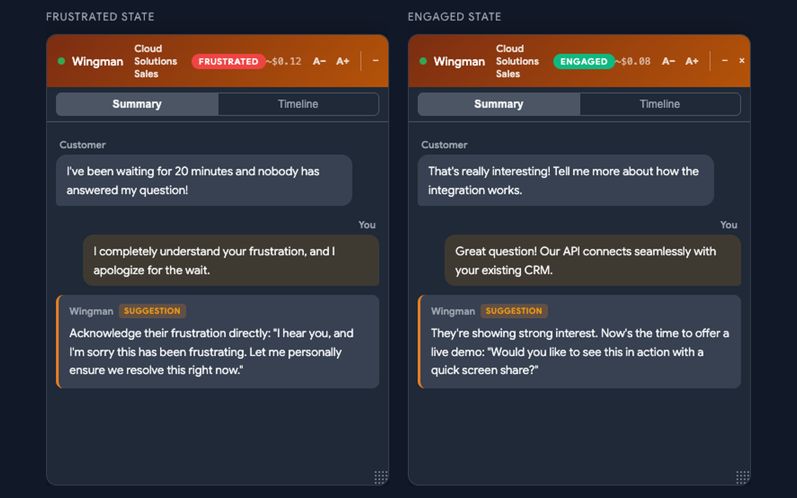
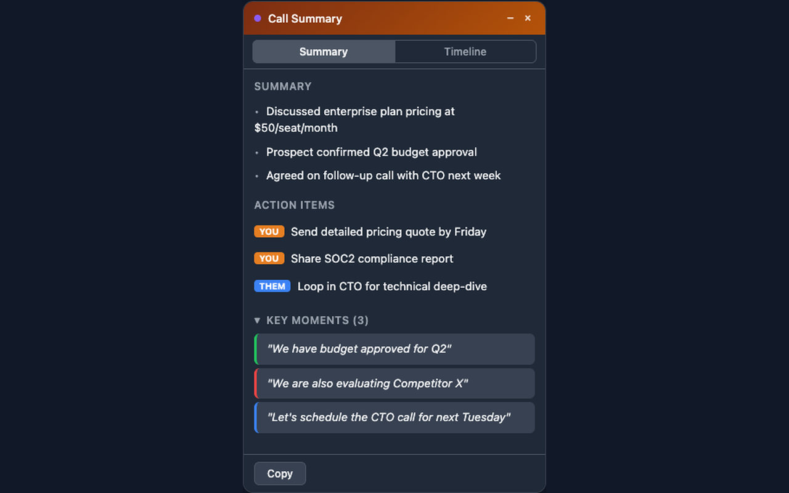
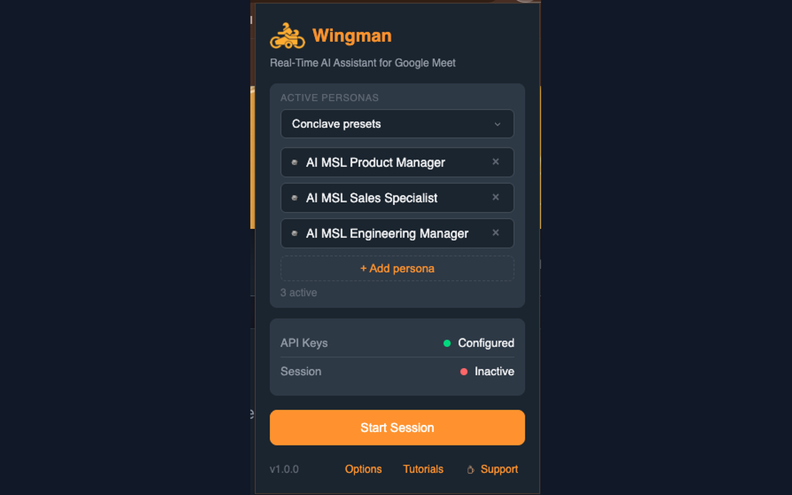

<p align="center">
  
</p>

<h3 align="center">Real-time AI suggestions, live transcription, and emotion detection — right inside Google Meet.</h3>

<p align="center">
  <a href="https://antoinedubuc.github.io/wingman-ai/">Landing Page</a> &bull;
  <a href="#-features">Features</a> &bull;
  <a href="#-get-started-in-5-minutes">Get Started</a> &bull;
  <a href="#-how-it-works">How It Works</a> &bull;
  <a href="docs/GETTING-STARTED.md">Docs</a>
</p>

<p align="center">
  
  
  
  
</p>

---

You're on a sales call. The prospect throws a curveball. You freeze.

**What if you had an expert whispering exactly what to say?**

Wingman AI sits invisibly in your Google Meet calls and delivers real-time suggestions, powered by your own documents, your own AI personas, and live emotion detection. No server. No subscription. No data ever leaves your browser.

> **Unlike meeting bots, Wingman is completely invisible to other participants.** No "AI assistant has joined" notification. No extra face in the grid. It's a browser extension overlay — your private advantage that nobody else on the call can see.

---

## ✨ Features

<table>
<tr>
<td width="50%" valign="top">

### 🎯 Live AI Suggestions

As the conversation flows, Wingman analyzes what's being said and delivers contextual response cards in real-time. It knows when to speak up — and when to stay silent.

Upload your sales decks, pricing sheets, and battlecards. Wingman searches them semantically during calls and surfaces the exact talking point you need.

</td>
<td width="50%" valign="top">

### 💬 In-Meeting Assistant <sub>NEW</sub>

Switch to the Assistant pill mid-call to ask the AI a question. Answers stream back grounded in the **live transcript**, your **persona Knowledge Bases**, and (optionally) **live web search**. Each reply tags which sources it used. Chat history persists across pill toggles.



</td>
</tr>
<tr>
<td width="50%" valign="top">

### 🎭 Multi-Persona System

Switch between expert personas mid-call: Discovery Coach, Sales Closer, Technical Expert, Objection Handler. Each has its own prompt and knowledge base.



</td>
<td width="50%" valign="top">

### 🧠 Conclave Mode

Activate up to **4 personas simultaneously**. Get suggestions from multiple expert perspectives at once — each attributed with a color-coded dot so you know who's talking.

Save team presets for different call types: Sales Team, Enterprise Deal, Discovery Only.



</td>
</tr>
<tr>
<td width="50%" valign="top">

### 😤 Emotion Detection

Powered by Hume AI, Wingman reads vocal prosody to detect emotional states in real-time: **engaged**, **frustrated**, **thinking**, or **neutral**.

The overlay badge updates live so you can adjust your approach before it's too late.



</td>
<td width="50%" valign="top">

### 🌍 Speaks Your Language <sub>NEW</sub>

The UI, AI suggestions, call summaries, and Assistant chat localize into **5 languages**: English, French, Spanish, Romanian, Russian.

Selling in Quebec? Pitching in Madrid? Discovery call in Bucharest? Same product, same private overlay — in your customer's language. Pick once in Settings, Wingman remembers.

</td>
</tr>
<tr>
<td width="50%" valign="top">

### 📋 Call Summaries → Google Drive

When the call ends, Wingman auto-generates a structured summary: key discussion points, action items, and follow-ups. One click saves it as a native Google Doc.



</td>
<td width="50%" valign="top">

### 💰 Real-Time Cost Tracking

See exactly what each call costs across all providers — live, as the call happens. No surprise bills. No hidden fees.

**~$0.50 per hour** with Deepgram + Gemini. Compare that to $100+/month for competing products with worse privacy.

</td>
</tr>
</table>

---

## 🔒 Privacy First — BYOK Architecture

> **Bring Your Own Keys.** No backend. No middleman. No data collection. Period.

Your audio, transcripts, and API keys never touch a server we control. The extension talks directly to your AI providers from your browser. You own your data completely.

```
┌─────────────────────────────────────────────────────────────────────┐
│                          YOUR BROWSER                               │
│                                                                     │
│   Google Meet  ◄────  Chrome Extension (Overlay + Audio Capture)    │
└─────────────────────────────────────────────────────────────────────┘
                              │
           ┌──────────────────┼──────────────────┐
           ▼                  ▼                  ▼
     ┌───────────┐     ┌───────────┐     ┌───────────┐
     │ Deepgram  │     │  Gemini   │     │  Hume AI  │
     │  Nova-3   │     │ 2.5 Flash │     │ Emotions  │
     │(Your Key) │     │(Your Key) │     │(Your Key) │
     └───────────┘     └───────────┘     └───────────┘
      Speech→Text      Text→Suggestions  Audio→Emotions
```

<details>
<summary><strong>🔌 Multi-Provider Support</strong> — Not locked into one AI provider</summary>

<br>

Choose the AI provider that works for you and switch anytime:

- **Google Gemini** — Gemini 2.5 Flash, 2.5 Pro
- **OpenRouter** — Claude Sonnet 4.6, Claude Opus 4.6, GPT-5.4, GPT-5.4 Mini, Llama 3.3 70B
- **Groq** — Llama 4 Scout, GPT-OSS 120B, GPT-OSS 20B, Qwen3 32B (blazing fast)

</details>

---

## 🚀 Get Started in 5 Minutes

**Step 1 →** Get free API keys

| Service | Free Tier |
|---------|-----------|
| [Deepgram](https://console.deepgram.com/) (speech-to-text) | $200 credit (~100 hours) |
| [Google Gemini](https://aistudio.google.com/apikey) (AI suggestions) | 1,500 requests/day |
| [Hume AI](https://platform.hume.ai/) (emotions, optional) | Free tier available |

**Step 2 →** Clone, install, build

```bash
git clone https://github.com/AntoineDubuc/wingman-ai.git
cd wingman-ai/wingman-ai/extension
npm install && npm run build
```

**Step 3 →** Load in Chrome

Open `chrome://extensions/` → Enable **Developer mode** → **Load unpacked** → select `extension/dist`

**Step 4 →** Configure and go

<p align="center">
  
</p>

Click the Wingman icon → **Options** → paste your API keys → pick a persona → join a Google Meet → **Start Session**. That's it.

---

## 🛠 Development

```bash
cd wingman-ai/extension

npm run dev            # Watch mode — rebuilds on save
npm run build          # Production build
npm test               # Unit tests (Vitest)
npm run typecheck      # TypeScript strict check
npm run lint           # ESLint
```

<details>
<summary><strong>📖 Engineering Documentation</strong></summary>

<br>

- [Getting Started](docs/GETTING-STARTED.md) — Setup and onboarding
- [File Structure](docs/FILE-STRUCTURE-MAP.md) — What each file does
- [Code Patterns](docs/CODE-PATTERNS.md) — Copy-paste patterns
- [Architecture](docs/diagrams/ARCHITECTURE.md) — System diagrams
- [Flow Diagrams](docs/flows/) — End-to-end feature traces

**Built with:** TypeScript (strict) · Chrome Manifest V3 · Vite · Deepgram Nova-3 · Google Gemini · Hume AI · IndexedDB · Google Drive API

</details>

---

<p align="center">
  <strong>Stop winging it. Start winning.</strong>
  <br><br>
  <a href="https://antoinedubuc.github.io/wingman-ai/">
    
  </a>
</p>

<p align="center">
  <sub>Copyright © 2025-2026 Antoine Dubuc / AI Entourage, Inc. All rights reserved.</sub>
</p>
