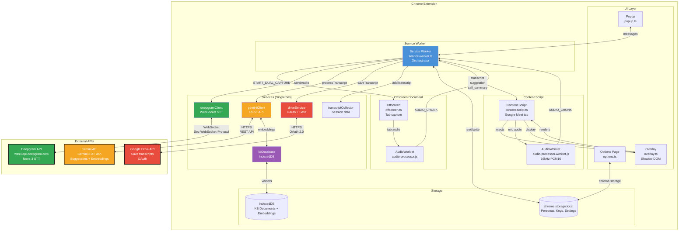
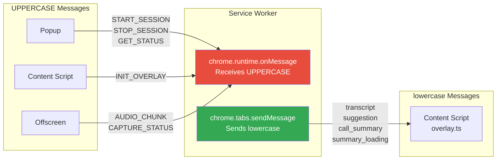
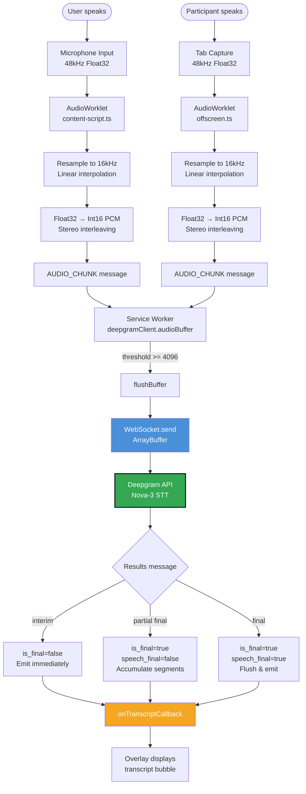
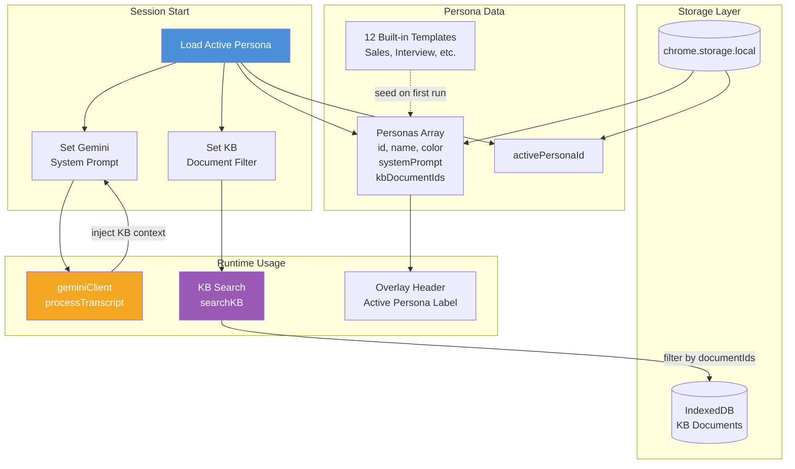

# System Architecture Diagram

## Component Overview



## Message Type Convention



## Data Flow: Audio to Transcript



## Persona System Architecture



## Key Conventions

### 1. Singleton Pattern
All services export singleton instances, not classes:
```typescript
export const deepgramClient = new DeepgramClient();
export const geminiClient = new GeminiClient();
```

### 2. Message Case Convention
- **Service Worker receives**: UPPERCASE (`START_SESSION`, `AUDIO_CHUNK`)
- **Service Worker sends to content script**: lowercase (`transcript`, `suggestion`)

### 3. WebSocket Auth
Deepgram requires `Sec-WebSocket-Protocol` header (browser limitation):
```typescript
new WebSocket(url, ['token', apiKey]);  // ✅ Correct
```

### 4. Async Message Responses
```typescript
chrome.runtime.onMessage.addListener((message, _, sendResponse) => {
  handleAsync(message).then(sendResponse);
  return true;  // ⚠️ Critical: keeps channel open
});
```

## Component Responsibilities

| Component | Responsibility | Context |
|-----------|---------------|---------|
| **Service Worker** | Orchestration, message routing, session lifecycle | Background |
| **Content Script** | Mic capture, overlay injection, message bridge | Google Meet tab |
| **Offscreen Document** | Tab audio capture (requires offscreen context) | Offscreen |
| **Overlay** | UI rendering (Shadow DOM isolation) | Google Meet tab |
| **deepgramClient** | WebSocket STT connection | Service Worker |
| **geminiClient** | REST API for suggestions + embeddings | Service Worker |
| **driveService** | OAuth + file upload to Drive | Service Worker |
| **kbDatabase** | IndexedDB wrapper for vectors | Service Worker |
| **transcriptCollector** | Session data accumulation | Service Worker |
