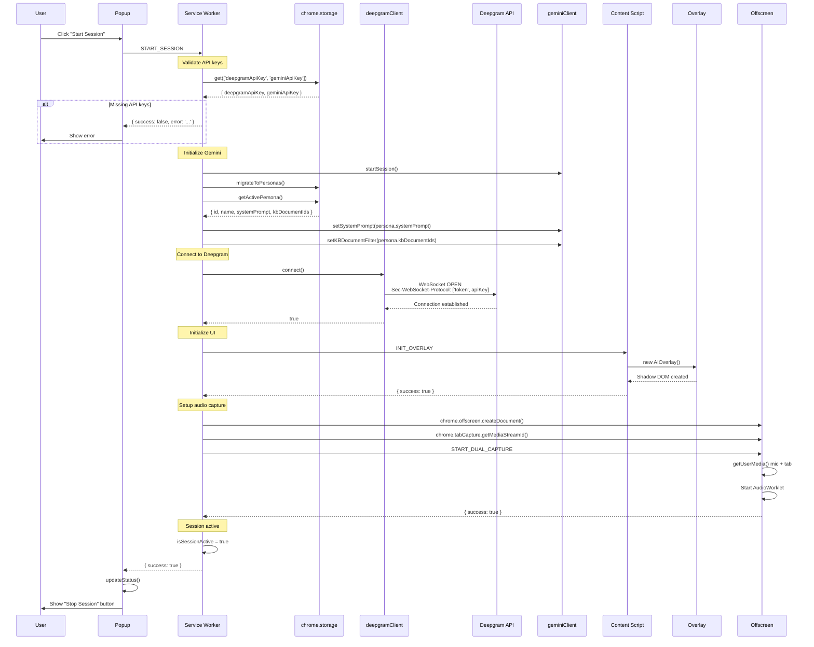
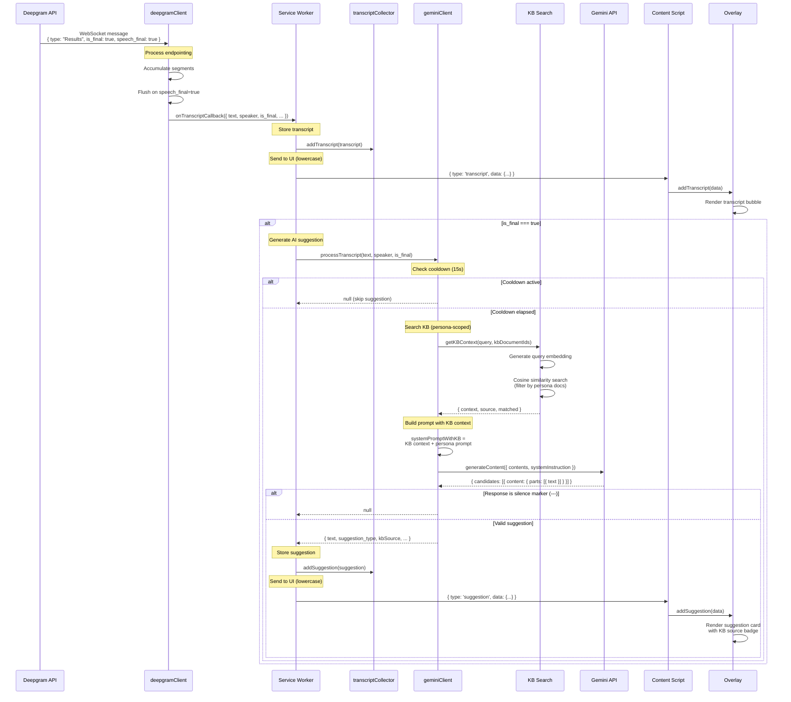
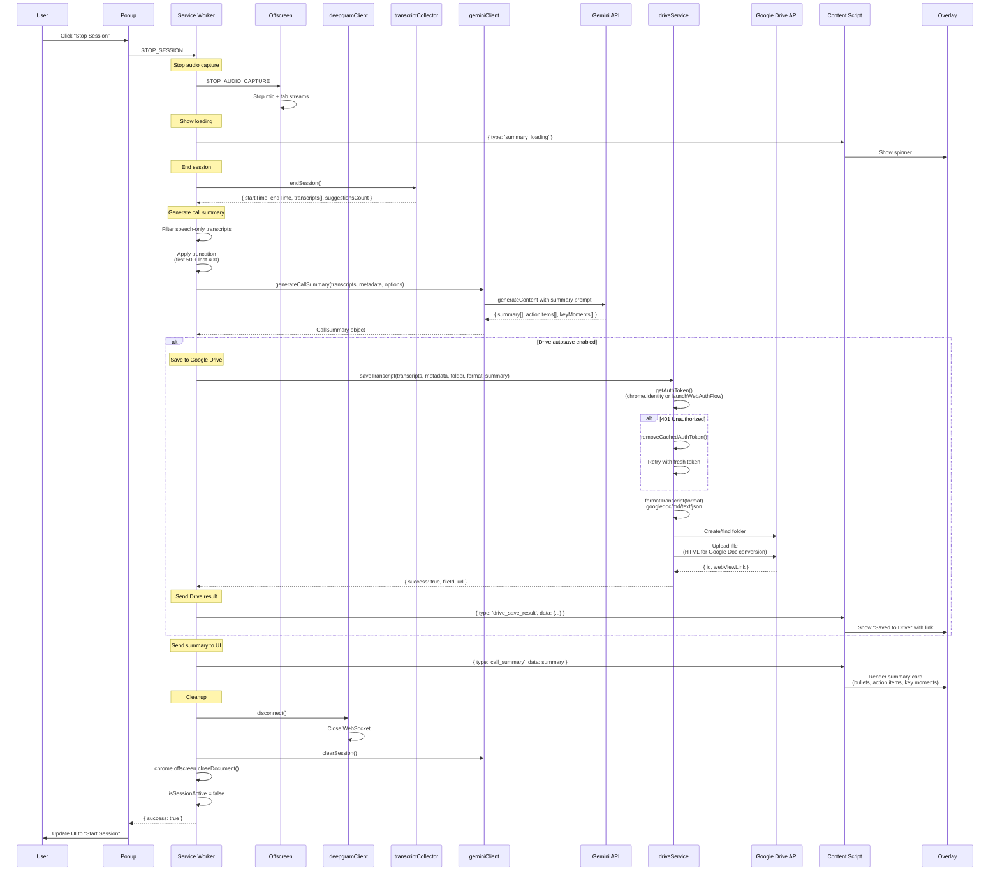
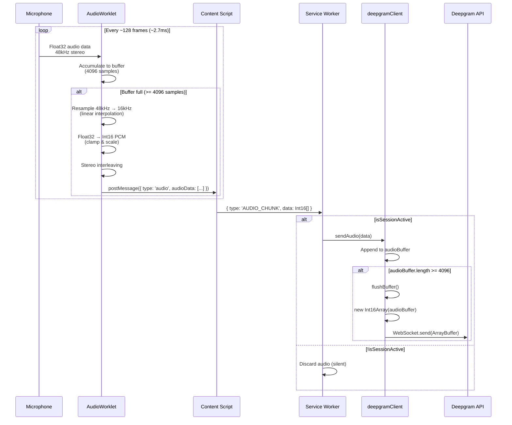
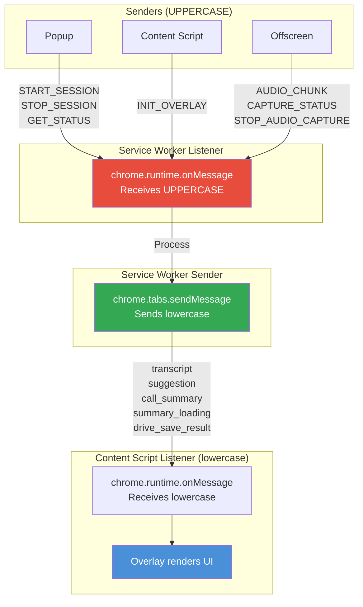
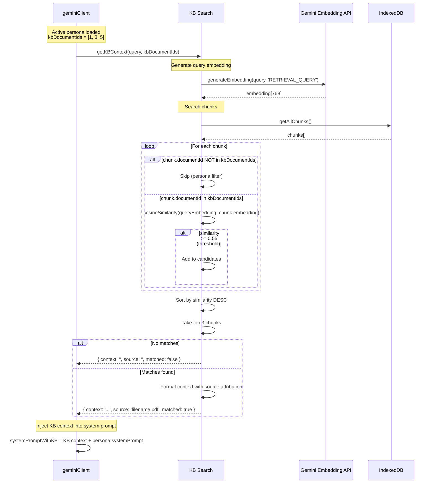
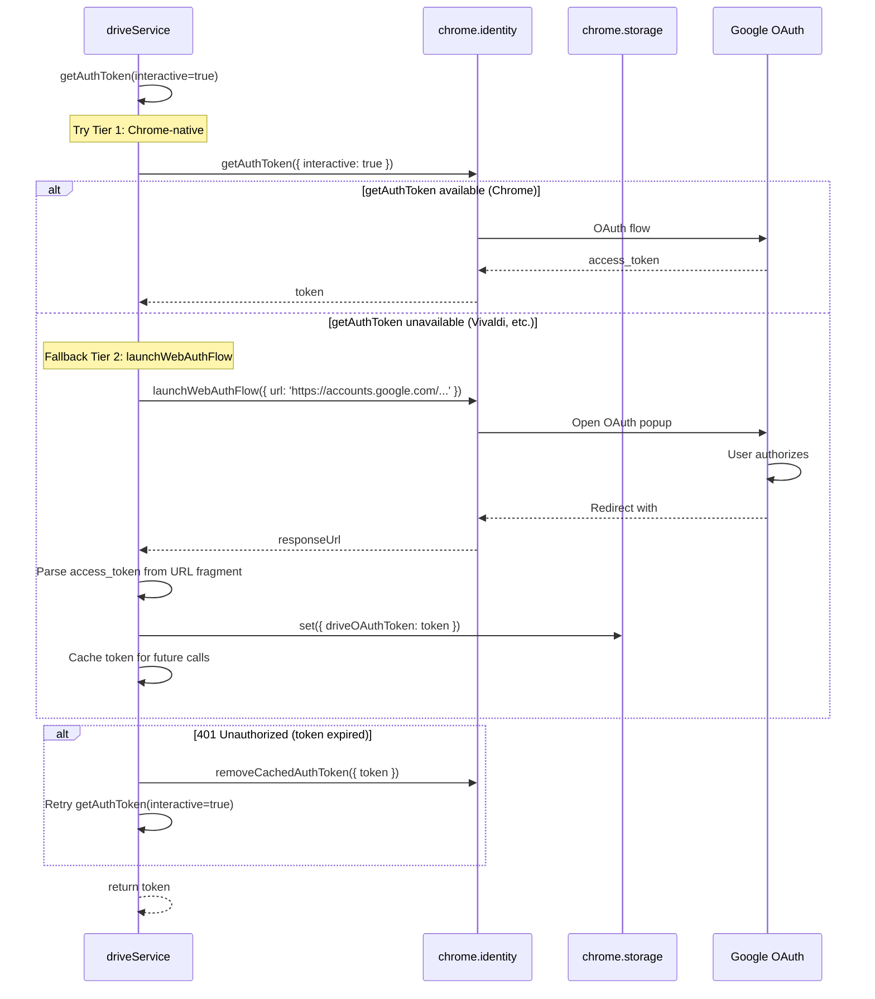

# Sequence Diagrams

## Session Start Flow

## Transcript to Suggestion Flow

## Session Stop and Summary Flow

## Audio Chunk Flow

## Message Type Convention Flow

## KB Search with Persona Scoping

## Drive OAuth Flow (Cross-Browser)

